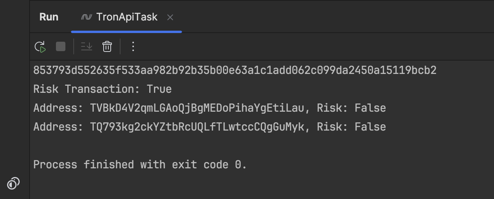

# TronApiTask

### Результат выполнения:

### Использованные пакеты: 

- `System.Net.Http` для работы с HTTP-запросами.

- `Newtonsoft.Json` для удобной обработки JSON-ответов.

### Шаги решения: 

1) Изучение документации и поиск нужного endpoint `API TronScan`, который предоставляет данные по транзакциям.

2) Установка необходимых пакетов.

3) Создание метода для отправки GET-запроса к `API TronScan`.

4) Обработка ответа, чтобы извлечь уровень риска.
